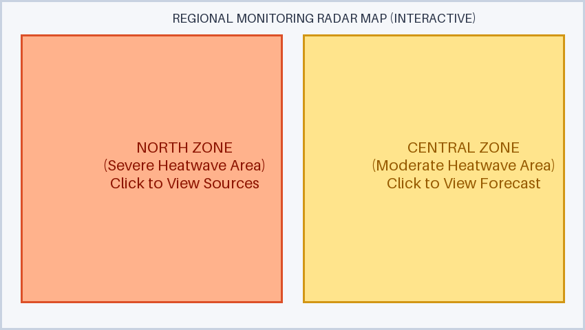

# CLIMATE INTELLIGENCE HEATWAVE MONITORING & EARLY WARNING WEB PORTAL
## Comprehensive Project Compendium & Viva Defense Guide
**Semester:** III | **Class/Div:** SY C-1 | **Academic Year:** 2026–27  
**Mini Project Evaluation Date:** Thursday, 8th October 2026 (During Lab Hours)  
**Total Marks:** 25 Marks (Based on Lab Experiments 1 to 5)

---

### Team Members & Module Distribution
| Team Member | Roll No / Div | Primary Role | Modules & Files Responsible For |
| :--- | :--- | :--- | :--- |
| **Mohammad Palekar** | **16010125167** (C-1) | **Project Lead & Core HTML5 Architecture** | `index.html`, `forecast.html`, `about.html`, `media.html`, `hotspot.html` |
| **Gaurav** | **16010125164** (C-1) | **UI/UX & CSS3 Styling Specialist** | `css/style.css`, Layout Architecture, Box Model, Animations |
| **Samarth** | **16010125161** (C-1) | **JavaScript Logic & Form Validation Engineer** | `js/validation.js`, `js/analytics.js`, `register.html`, `analysis.html` |

---

## Evaluation Rubrics & Compliance Matrix (Target: 25 / 25 Marks)

| Criteria | Max Marks | Institutional Rubric Standard (Excellent) | How Our Project Satisfies This |
| :--- | :---: | :--- | :--- |
| **1. Timely Submission & Team Performance** | **5 M** | On-time submission, active participation of all team members, and complete integration of modules. | Ready prior to 8th October. All 3 members have clearly defined, interdependent modules integrated into a single responsive portal without broken links. |
| **2. Designing of Web Pages with Proper Documentation** | **10 M** | Well-organized contents (4-5M) + Professional GUI presentation & design properties (5M). | 8 semantic HTML5 pages, unified color scheme, CSS Box model, zebra-striped tables, card components, glowing alert boxes, and this comprehensive compendium. |
| **3. Accessibility & Layout Flexibility** | **5 M** | 1. Web pages are 100% browser-compatible.<br>2. Page layouts do not depend on fixed screen resolutions. | Tested and verified on Google Chrome, Microsoft Edge, and Firefox. Uses CSS Flexbox, percentage/max-width containers, and responsive media queries (`@media`). Includes `<noscript>` and `<abbr>` tags. |
| **4. Presentation & Specific Features** | **5 M** | Rich content with specific advanced features implemented cleanly. | Includes Regex form validation, temperature array traversals, OOP JavaScript climate objects, interactive coordinate image maps, and HTML5 multimedia. |

---

# PART 1: MOHAMMAD PALEKAR (16010125167)
### Role: Project Lead & Core Semantic HTML5 Architecture

---

### 1.1 Responsibilities & Modules Overview
Mohammad was responsible for conceptualizing the system architecture, structuring all multi-page semantic documents, and implementing the core HTML5 components:
1. **Home Portal (`index.html`)**: Establishing standard HTML5 document structure, global attributes (`id`, `class`, `title`, `style`), tooltip integration, and semantic landmarks.
2. **Meteorological Forecast Table (`forecast.html`)**: Implementing advanced tabular data structures utilizing `<caption>`, `<thead>`, `<tbody>`, `<tfoot>`, and multi-cell spanning (`rowspan`, `colspan`).
3. **System Documentation & Stakeholder Workflows (`about.html`)**: Structuring block vs. inline elements, blockquotes, ordered/unordered/nested lists, and description lists (`<dl>`, `<dt>`, `<dd>`).
4. **Interactive Hotspot Map (`hotspot.html`)**: Constructing client-side image maps using ``, `<map>`, and `<area>` with coordinate rectangles.
5. **Media & Awareness Center (`media.html`)**: Embedding native `<video>`, `<audio>`, external Doppler radar `<iframe>`, and `<noscript>` graceful degradation tags.

---

### 1.2 Deep-Dive Code Explanation

#### A. Semantic Document Landmarks (`index.html`)
```html
<!DOCTYPE html>
<html lang="en">
<head>
    <meta charset="UTF-8">
    <meta name="viewport" content="width=device-width, initial-scale=1.0">
    <title>Heatwave Intelligence System - Home</title>
    <link rel="stylesheet" href="css/style.css">
</head>
<body>
    <header class="site-header">
        <h1 id="system-title" class="site-title" 
            title="An early warning system for detecting and predicting heatwaves across regions">
            Heatwave Intelligence System
        </h1>
    </header>
```
* **Explanation:**
  * `<!DOCTYPE html>` instructs the browser to parse the document strictly using the HTML5 specification (standard mode).
  * `<meta name="viewport" content="width=device-width, initial-scale=1.0">` ensures proper mobile device rendering by matching the screen's native pixel width.
  * `title="..."` attribute on `<h1>` satisfies Task 1 of Experiment 1 by providing a native browser tooltip when the user hovers over the system heading.
  * Semantic landmarks (`<header>`, `<nav>`, `<main>`, `<article>`, `<aside>`, `<footer>`) provide meaningful structure to assistive devices and search engines rather than generic `<div>` containers.

#### B. Meteorological Forecast Table Structure (`forecast.html`)
```html
<table class="data-table">
    <caption>Heatwave Forecast Report (Active Surveillance Cycle)</caption>
    <thead>
        <tr>
            <th rowspan="2">Region</th>
            <th rowspan="2">Station</th>
            <th colspan="2" style="text-align: center;">Forecast Parameters</th>
        </tr>
        <tr>
            <th>Max Temperature</th>
            <th>Severity Level</th>
        </tr>
    </thead>
    <tbody>
        <tr>
            <td>North Zone</td>
            <td>Station A1 (Urban Core)</td>
            <td>47°C</td>
            <td><span class="status-pill severe">Severe</span></td>
        </tr>
        <!-- additional station rows -->
    </tbody>
    <tfoot>
        <tr>
            <td colspan="4">Report generated by Heatwave Intelligence System</td>
        </tr>
    </tfoot>
</table>
```
* **Explanation:**
  * `<caption>`: Provides an accessible title directly tied to the table for screen readers.
  * `rowspan="2"`: Merges the "Region" and "Station" headers across two vertical rows so they align with the multi-column forecast parameters.
  * `colspan="2"`: Horizontally merges the "Forecast Parameters" super-header across both "Max Temperature" and "Severity Level".
  * `colspan="4"` in `<tfoot>`: Spans across all 4 columns to create a clean full-width summary footer.

#### C. Regional Hotspot Image Map (`hotspot.html`)
```html
<div class="map-container">
    
    <map name="hotspotmap">
        <area shape="rect" coords="30,50,410,440" href="about.html" alt="North Zone" title="Click to view North Zone Sources">
        <area shape="rect" coords="440,50,820,440" href="forecast.html" alt="Central Zone" title="Click to view Central Zone Forecast">
    </map>
</div>
```
* **Explanation:**
  * `usemap="#hotspotmap"` links the static image directly to the client-side `<map>` definition via its matching `name` attribute.
  * `shape="rect"` defines rectangular clickable zones.
  * `coords="x1, y1, x2, y2"` specifies the exact bounding pixel coordinates: `(30, 50)` top-left to `(410, 440)` bottom-right for the North Zone, and `(440, 50)` to `(820, 440)` for the Central Zone.
  * Clicking these hotspots navigates the browser directly without any JavaScript overhead.

#### D. Multimedia & Fallback Handling (`media.html`)
```html
<video width="640" height="360" controls poster="images/region-map.png">
    <source src="media/awareness-video.mp4" type="video/mp4">
    <p>Your browser does not support HTML5 video streaming.</p>
</video>

<audio controls>
    <source src="media/advisory-audio.mp3" type="audio/mpeg">
    Your browser does not support HTML5 audio playback.
</audio>

<iframe src="https://mausam.imd.gov.in" width="100%" height="420" title="Live Radar Site"></iframe>
<noscript>
    <p>Please enable JavaScript to use all features of this portal.</p>
</noscript>
```
* **Explanation:**
  * `controls`: Enables native browser playback controls (play, pause, volume, full-screen).
  * `<source>`: Specifies media URI and MIME types (`video/mp4`, `audio/mpeg`). The fallback paragraph executes only if the browser fails to support the codec.
  * `<iframe>`: Seamlessly embeds external live meteorological Doppler charts inside the sandboxed page container.
  * `<noscript>`: Renders an immediate notification if client-side scripting is disabled, fulfilling Experiment 1 Task 9.

---

### 1.3 Mohammad's Viva / Examiner Q&A Guide
* **Q1: Why did you use semantic elements instead of simple `<div>` tags?**  
  * *Answer:* Semantic elements like `<header>`, `<nav>`, `<main>`, `<article>`, `<aside>`, and `<footer>` clearly describe their meaning to both the browser and developers. They improve web accessibility for screen readers (ARIA landmark roles) and enhance search engine optimization (SEO).
* **Q2: What is the difference between `rowspan` and `colspan` in HTML tables?**  
  * *Answer:* `colspan` merges two or more horizontal columns into a single header or data cell, whereas `rowspan` merges two or more vertical rows down a column. We used `rowspan="2"` on Region/Station and `colspan="2"` on Forecast Parameters.
* **Q3: How does a client-side image map work?**  
  * *Answer:* An image map pairs an `` tag having a `usemap="#mapname"` attribute with a `<map name="mapname">` tag. Inside the map, `<area>` tags define geometric shapes (`rect`, `circle`, `poly`) with pixel coordinates (`coords`) that act as hyperlinks.
* **Q4: What is the purpose of `<noscript>`?**  
  * *Answer:* The `<noscript>` element defines alternate content to be displayed to users who have disabled JavaScript in their browser or whose browser does not support client-side scripting.

---

# PART 2: GAURAV (16010125164)
### Role: Front-End UI/UX Designer & CSS3 Styling Specialist

---

### 2.1 Responsibilities & Modules Overview
Gaurav was responsible for visual presentation, responsive layout architecture, component modularity, and CSS3 styling:
1. **Centralized External Stylesheet (`css/style.css`)**: Establishing separation of concerns, eliminating redundant inline styles, and configuring site-wide typography.
2. **Responsive Layout Grid (Flexbox & Media Queries)**: Designing a flexible multi-column container with a sticky navigation bar and responsive sidebar.
3. **CSS Box Model & Component Cards**: Applying consistent padding, borders, margins, and subtle box shadows to create clean information cards.
4. **Table & Form Styling**: Implementing border-collapse, zebra-striping via `:nth-child(even)`, and interactive hover/focus states.
5. **Keyframe Animations & Visual Highlights**: Building an animated glowing/blinking Level 4 Alert box using `@keyframes` and box-shadow transitions (Experiment 2 Task 10).

---

### 2.2 Deep-Dive Code Explanation

#### A. Responsive Layout Grid & Sticky Navigation (`css/style.css`)
```css
nav.main-nav {
    background-color: #2c3e50;
    position: sticky;
    top: 0;
    z-index: 100;
    box-shadow: 0 2px 6px rgba(0,0,0,0.15);
}

nav.main-nav ul {
    list-style-type: none;
    display: flex;
    flex-wrap: wrap;
    justify-content: center;
}

nav.main-nav a {
    display: block;
    color: #ecf0f1;
    text-decoration: none;
    padding: 12px 16px;
    font-size: 14px;
    transition: background-color 0.2s ease, color 0.2s ease;
}

nav.main-nav a:hover {
    background-color: #d35400;
    color: #ffffff;
}
```
* **Explanation:**
  * `position: sticky; top: 0;`: Keeps the navigation bar pinned at the top of the browser viewport during long scrolls, preventing navigation loss.
  * `display: flex; flex-wrap: wrap;`: Flexbox distributes nav links across the horizontal bar. `flex-wrap` allows links to cleanly wrap on smaller screens.
  * `:hover` pseudo-class: Delivers immediate visual feedback by transitioning link colors smoothly using `transition: 0.2s ease`.

#### B. Multi-Column Layout & Media Queries
```css
.layout-grid {
    display: flex;
    gap: 20px;
}

.main-content {
    flex: 3;
}

.sidebar {
    flex: 1;
}

@media (max-width: 800px) {
    .layout-grid {
        flex-direction: column;
    }
}
```
* **Explanation:**
  * Employs CSS Flexbox with a 3:1 ratio (`flex: 3` for content, `flex: 1` for sidebar).
  * `@media (max-width: 800px)`: Satisfies the accessibility rubric criterion (layout independence of screen resolution). When screen width drops below 800px (tablets/phones), `flex-direction` switches to `column`, stacking the sidebar neatly beneath the main content.

#### C. CSS Box Model Implementation & Card Components
```css
.card {
    background-color: #ffffff;
    border: 1px solid #dcdfe6;
    border-radius: 6px;
    padding: 20px;
    margin-bottom: 20px;
    box-shadow: 0 1px 3px rgba(0,0,0,0.06);
}
```
* **Explanation:**
  * Demonstrates the complete CSS Box Model:
    * **Content:** The text and images inside the card.
    * **Padding (`20px`):** Internal space between card content and the border.
    * **Border (`1px solid #dcdfe6`):** Defined perimeter outline with rounded corners (`border-radius: 6px`).
    * **Margin (`margin-bottom: 20px`):** External breathing room separating cards vertically.
    * **Box Shadow:** Subtle shadow providing depth without heavy visual clutter.

#### D. Table Zebra-Striping & Pseudo-Classes
```css
.data-table {
    width: 100%;
    border-collapse: collapse;
}

.data-table thead th {
    background-color: #1e293b;
    color: #ffffff;
}

.data-table tbody tr:nth-child(even) {
    background-color: #f8fafc;
}

.data-table tbody tr:hover {
    background-color: #f1f5f9;
}
```
* **Explanation:**
  * `border-collapse: collapse;`: Merges adjacent cell borders into single crisp lines.
  * `:nth-child(even)`: Automatically targets every alternate row in the table body, applying an off-white background tint. This zebra-striping dramatically enhances legibility across multi-column weather data tables.
  * `:hover`: Highlights whichever table row the user's cursor is currently inspecting.

#### E. Glowing CSS Animation Effect (Experiment 2 Task 10)
```css
.glowing-alert {
    background-color: #fff1f2;
    border: 2px solid #e11d48;
    color: #9f1239;
    padding: 16px;
    border-radius: 6px;
    text-align: center;
    margin-bottom: 20px;
    animation: alertGlow 1.8s infinite alternate;
}

@keyframes alertGlow {
    from {
        box-shadow: 0 0 5px rgba(225, 29, 72, 0.3);
    }
    to {
        box-shadow: 0 0 18px rgba(225, 29, 72, 0.85);
    }
}
```
* **Explanation:**
  * Directly fulfills Task 10 requirements: glowing/blinking effect to draw urgent attention to severe events.
  * `@keyframes alertGlow`: Cycles the `box-shadow` intensity smoothly between 5px and 18px spread.
  * `animation: alertGlow 1.8s infinite alternate;`: Runs continuously in alternating directions, creating a pulsating warning beacon.

---

### 2.3 Gaurav's Viva / Examiner Q&A Guide
* **Q1: What are the components of the CSS Box Model?**  
  * *Answer:* From inside out, the Box Model consists of Content (the actual element data), Padding (space around content inside border), Border (line enclosing padding and content), and Margin (transparent space outside the border separating elements).
* **Q2: Why is an external stylesheet preferable to inline styling?**  
  * *Answer:* An external stylesheet enforces separation of concerns (content vs. design), eliminates duplicate code, reduces HTML file sizes, enables browser caching of styles, and allows site-wide theme updates by editing a single file (`css/style.css`).
* **Q3: How does `:nth-child(even)` work and why is it useful?**  
  * *Answer:* It is a structural pseudo-class that targets elements based on their numeric position among siblings. We used `tbody tr:nth-child(even)` to automatically create zebra-striping on our forecast table, which improves row scanning and readability.
* **Q4: How did you ensure the website is mobile-friendly without frameworks like Bootstrap?**  
  * *Answer:* By using standard CSS Flexbox layouts with relative widths, setting `box-sizing: border-box`, and writing `@media (max-width: 800px)` media queries to switch from a multi-column desktop layout into a single-column stacked layout on smaller screens.

---

# PART 3: SAMARTH (16010125161)
### Role: JavaScript Engine & Form Validation Engineer

---

### 3.1 Responsibilities & Modules Overview
Samarth was responsible for programming all dynamic client-side logic, data validation, and computational analytics:
1. **Regular Expression Validation Engine (`js/validation.js`)**: Writing strict regex patterns for Indian mobile numbers, emails, names, AWS station IDs, user IDs (`CLM-XXXX`), and 6-digit postal PINs.
2. **DOM Event Handling & Form Control (`register.html`)**: Attaching `submit` event listeners, executing `event.preventDefault()`, toggling error styles (`.input-error`, `.input-success`), and presenting clear error messages in adjacent `<span>` elements.
3. **Date Validation Logic**: Ensuring entered registration dates are valid and preventing users from selecting future dates.
4. **Temperature Array Telemetry Analytics (`js/analytics.js`)**: Traversal of multi-day temperature readings array `[34, 36, 38, 39, 41, 40, 37, 35, 39, 42]` to dynamically compute minimum, maximum, average, and counts of days exceeding the 37°C threshold and 40°C critical level.
5. **Object-Oriented Climate Data Entity (`analysis.html`)**: Encapsulating station data in a JavaScript object literal with methods using the `this` keyword (`displayData()`, `calculateDifference()`, `determineRisk()`, `updateAlert()`).

---

### 3.2 Deep-Dive Code Explanation

#### A. Regular Expression Validation Engine (`js/validation.js`)
```javascript
const regexPatterns = {
    name: /^[A-Za-z ]{3,}$/,
    mobile: /^[6-9]\d{9}$/,
    email: /^[^\s@]+@[^\s@]+\.[^\s@]+$/,
    stationId: /^AWS\d{3,}$/,
    userId: /^CLM-\d{4}$/,
    pinCode: /^\d{6}$/
};
```
* **Explanation:**
  * `name: /^[A-Za-z ]{3,}$/`: Ensures the name contains only upper/lowercase alphabets and spaces, requiring at least 3 characters.
  * `mobile: /^[6-9]\d{9}$/`: Validates Indian mobile numbers: starts with digits 6, 7, 8, or 9 followed by exactly 9 more digits (`\d{9}`), totaling 10 digits.
  * `email: /^[^\s@]+@[^\s@]+\.[^\s@]+$/`: Standard RFC-style regex verifying non-whitespace characters preceding `@`, domain name, and top-level domain `.`.
  * `stationId: /^AWS\d{3,}$/`: Requires the literal string "AWS" followed by 3 or more digits (e.g., `AWS001`).
  * `userId: /^CLM-\d{4}$/`: Requires "CLM-" followed by exactly 4 digits (e.g., `CLM-1234`), satisfying Experiment 5 Task 5.
  * `pinCode: /^\d{6}$/`: Enforces exactly 6 numeric digits for Indian postal codes.

#### B. DOM Manipulation & Event Handling (`js/validation.js`)
```javascript
document.getElementById("climateRegForm").addEventListener("submit", function (e) {
    e.preventDefault(); // Prevents page reload
    let isValid = true;

    // Validate User Name
    const nameInput = document.getElementById("regName");
    const nameErr = document.getElementById("regNameErr");
    if (!regexPatterns.name.test(nameInput.value.trim())) {
        nameInput.classList.add("input-error");
        nameErr.textContent = "Name must contain only alphabets and spaces (min 3 chars)";
        isValid = false;
    } else {
        nameInput.classList.remove("input-error");
        nameInput.classList.add("input-success");
        nameErr.textContent = "";
    }
    
    // Future Date Prevention
    const dateInput = document.getElementById("regDate");
    const selectedDate = new Date(dateInput.value);
    const today = new Date();
    today.setHours(23, 59, 59, 999);

    if (dateInput.value === "") {
        isValid = false;
    } else if (selectedDate > today) {
        document.getElementById("regDateErr").textContent = "Registration date cannot be in the future";
        isValid = false;
    }

    if (isValid) {
        document.getElementById("regSuccessMsg").style.display = "block";
    }
});
```
* **Explanation:**
  * `e.preventDefault()`: Intercepts the browser's default form submission behavior, preventing a full page reload and allowing JavaScript to evaluate all fields locally.
  * `.test()` method: Evaluates the input string against the regex pattern, returning `true` or `false`.
  * `.classList.add("input-error")`: Dynamically adds CSS classes to turn field borders red for invalid inputs and green for valid inputs.
  * `selectedDate > today`: Converts the date string to a JavaScript `Date` object and compares timestamps to disallow future registration dates.

#### C. Multi-Day Temperature Array Analytics (`js/analytics.js`)
```javascript
const temperatureReadings = [34, 36, 38, 39, 41, 40, 37, 35, 39, 42];
const heatwaveThreshold = 37;

function runArrayAnalytics() {
    let minTemp = temperatureReadings[0];
    let maxTemp = temperatureReadings[0];
    let sum = 0;
    let aboveThresholdCount = 0;
    let aboveEqual40Count = 0;
    let heatwaveReadings = [];

    for (let i = 0; i < temperatureReadings.length; i++) {
        let temp = temperatureReadings[i];
        sum += temp;

        if (temp < minTemp) minTemp = temp;
        if (temp > maxTemp) maxTemp = temp;
        if (temp > heatwaveThreshold) aboveThresholdCount++;
        if (temp >= 40) {
            aboveEqual40Count++;
            heatwaveReadings.push(temp);
        }
    }

    const avgTemp = (sum / temperatureReadings.length).toFixed(1);
}
```
* **Explanation:**
  * Fulfills Experiment 5 Task 4 by traversing the given sensor reading array using a standard `for` loop.
  * Computes:
    * **Minimum:** Initialized to `readings[0]`, updated if `temp < minTemp` (result: **34°C**).
    * **Maximum:** Initialized to `readings[0]`, updated if `temp > maxTemp` (result: **42°C**).
    * **Average:** Sum of all elements divided by `length`, rounded using `.toFixed(1)` (result: **38.1°C**).
    * **Threshold Days (> 37°C):** Increments counter when condition is met (result: **6 Days**).
    * **Critical Days (≥ 40°C):** Pushes values into `heatwaveReadings` array (result: **3 Days: [41°C, 40°C, 42°C]**).

#### D. Object-Oriented Encapsulation with `this` Keyword
```javascript
const climateData = {
    location: "Coastal Monitoring Station",
    city: "Mumbai",
    temperature: 39,
    humidity: 65,
    heatwaveThreshold: 37,
    riskLevel: "High",

    calculateDifference: function () {
        return this.temperature - this.heatwaveThreshold;
    },

    determineRisk: function () {
        if (this.temperature >= 40) {
            this.riskLevel = "Severe";
        } else if (this.temperature >= 38 && this.humidity >= 60) {
            this.riskLevel = "High";
        } else if (this.temperature >= 35) {
            this.riskLevel = "Moderate";
        } else {
            this.riskLevel = "Normal";
        }
        return this.riskLevel;
    }
};
```
* **Explanation:**
  * Direct implementation of Experiment 5 Task 3 using Object Literal syntax.
  * Encapsulates state properties (`temperature`, `humidity`, `threshold`) and operational member functions.
  * The `this` keyword refers to the owning object (`climateData`), allowing methods to read and modify internal properties cleanly.

---

### 3.3 Samarth's Viva / Examiner Q&A Guide
* **Q1: Why do we call `event.preventDefault()` inside a form submit handler?**  
  * *Answer:* By default, submitting an HTML form sends an HTTP POST/GET request and reloads the web page. Calling `event.preventDefault()` stops that default browser action, allowing our JavaScript validation function to check fields, display errors, and keep user data intact on screen.
* **Q2: Explain the Regular Expression `/^[6-9]\d{9}$/` used for mobile numbers.**  
  * *Answer:* `^` matches the beginning of the string. `[6-9]` requires the first digit to be 6, 7, 8, or 9 (standard Indian mobile prefix). `\d{9}` requires exactly nine more numeric digits (0–9). `$` matches the end of the string, ensuring the input is strictly 10 digits without trailing letters or symbols.
* **Q3: What does the `this` keyword refer to inside an object method?**  
  * *Answer:* In JavaScript, when a function is invoked as a method of an object (like `climateData.determineRisk()`), `this` refers to the object that owns and called the method, giving it direct access to properties like `this.temperature` and `this.humidity`.
* **Q4: How did you calculate average temperature from the array?**  
  * *Answer:* We initialized an accumulator `sum = 0`, traversed through the array `temperatureReadings` using a `for` loop adding each element to `sum`, and then divided `sum` by `temperatureReadings.length`. We used `.toFixed(1)` to round the floating-point result to 1 decimal place (38.1°C).

---

# PART 4: TEAM PRESENTATION ROADMAP (FOR 8TH OCTOBER)
### Recommended 8–10 Minute Group Defense Script

| Time | Speaker | Slides Covered | Key Talking Points & Live Demo Actions |
| :---: | :--- | :---: | :--- |
| **0:00 – 2:00** | **Mohammad Palekar** | **Slides 1 – 4** | • Introduce project title and team members.<br>• State the climate intelligence problem statement and rising heatwave challenges.<br>• Outline core project objectives and rubric compliance (25/25 target). |
| **2:00 – 4:00** | **Mohammad Palekar** | **Slides 5, 7, 8** | • Explain HTML5 semantic landmarks and separation of concerns.<br>• Demonstrate **Home Portal (`index.html`)** & **Alert Bulletin (`alerts.html`)** showcasing `<mark>`, `<abbr>`, `<sup>`, `<sub>`.<br>• Show **Hotspot Map (`hotspot.html`)** clicking North/Central zones. |
| **4:00 – 6:00** | **Gaurav** | **Slides 6, 9 (Forecast)** | • Explain CSS3 architecture: external `style.css`, Flexbox layout grid, and mobile responsiveness.<br>• Demonstrate the **Forecast Table (`forecast.html`)**: highlight `rowspan`, `colspan`, and `:nth-child(even)` zebra-striping.<br>• Point out the glowing alert box running on `@keyframes alertGlow`. |
| **6:00 – 8:00** | **Samarth** | **Slides 9 (Analytics), 10 (Form)** | • Open **Climate Analytics (`analysis.html`)**: demonstrate live array traversal (min 34°C, max 42°C, avg 38.1°C) and OOP object methods.<br>• Open **Registration Form (`register.html`)**: click Submit with blank fields to trigger red border error states; then enter valid data to trigger the green success message. |
| **8:00 – 9:00** | **All 3 Members** | **Slides 11 – 13** | • Summarize technical concepts covered across Experiments 1 to 5.<br>• Present Future Scope (IoT sensors, WebSockets, PWAs).<br>• Conclude and open floor for Examiner / Faculty Viva Q&A. |
