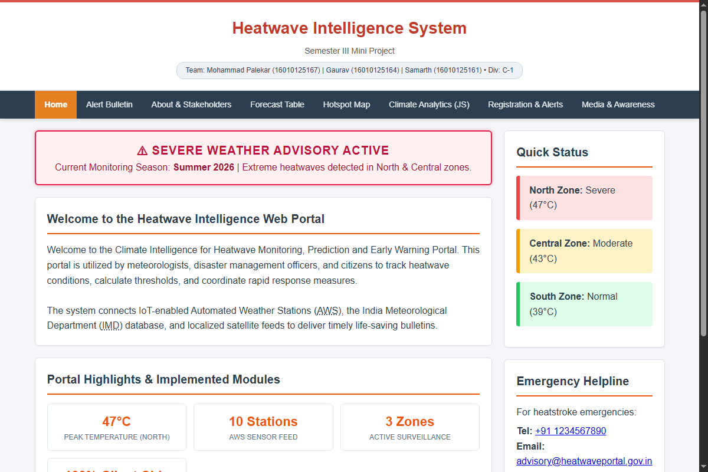
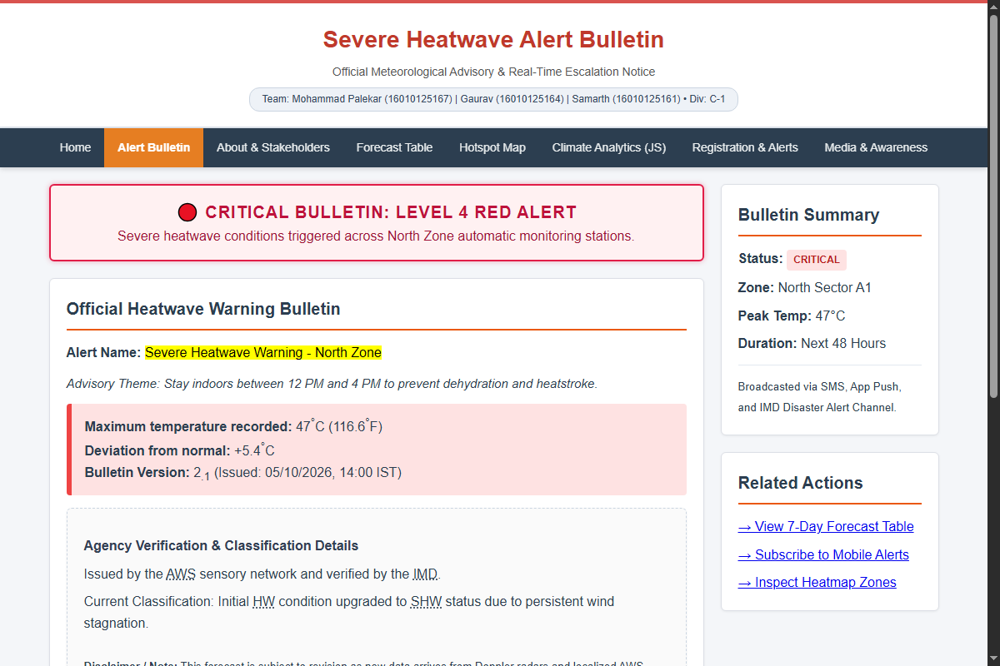
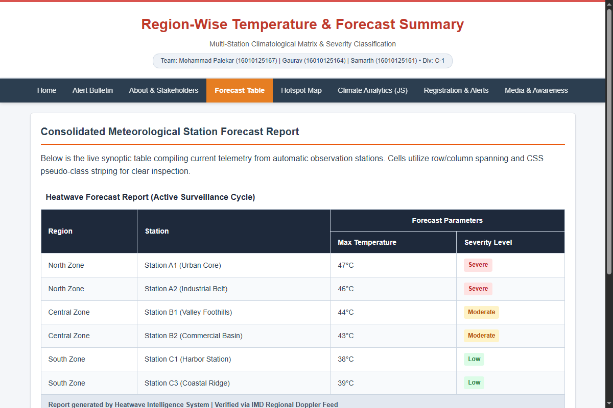
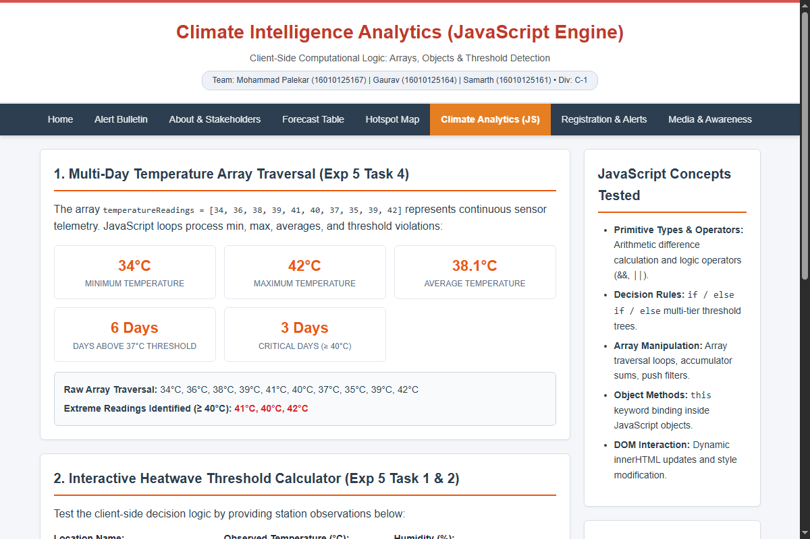
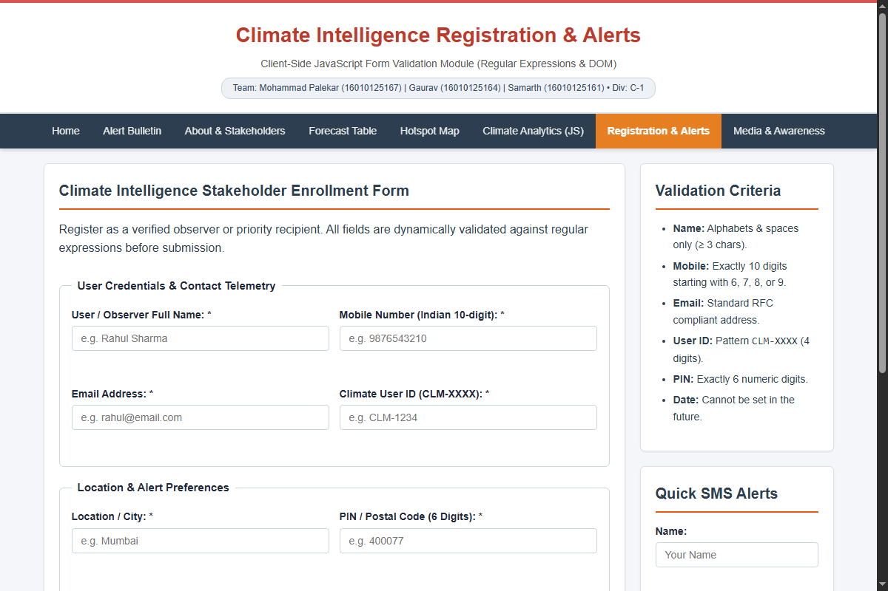
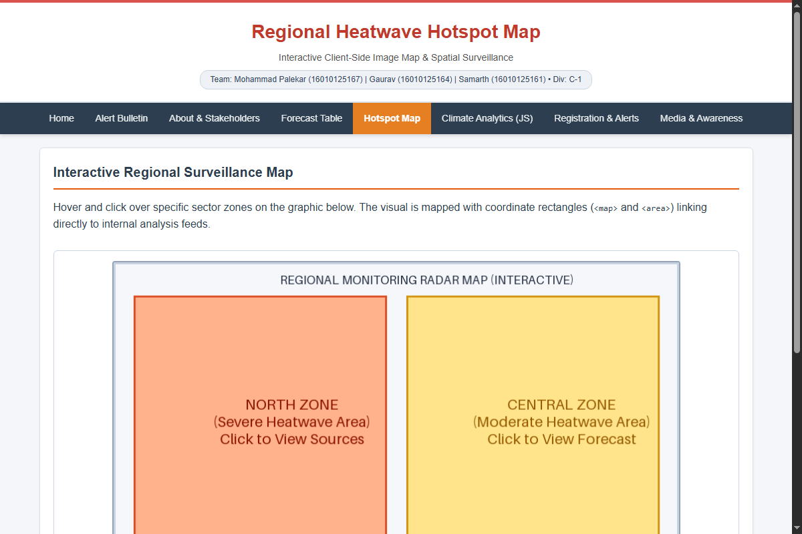

# Climate Intelligence Heatwave Monitoring & Early Warning Web Portal

A lightweight, accessible client-side web portal designed for real-time heatwave monitoring, automated threshold calculations, and stakeholder early-warning registration.

## Team Members
* **Mohammad Palekar** (Roll No: `16010125167`) — Project Lead & Core Semantic HTML5 Architecture
* **Gaurav** (Roll No: `16010125164`) — Front-End UI/UX & CSS3 Styling Specialist
* **Samarth** (Roll No: `16010125161`) — JavaScript Logic & Form Validation Engineer

**Class / Division:** SY C-1 | **Semester:** III  
**Evaluation Date:** Thursday, 8th October 2026  

---

## Key Features & Lab Curriculum Integration
1. **Semantic HTML5:** Native landmark elements (`<header>`, `<nav>`, `<main>`, `<article>`, `<aside>`, `<footer>`), text-level formatting (`<mark>`, `<abbr>`, `<sup>`, `<sub>`), and coordinate image maps (`<map>`, `<area>`).
2. **Tabular Meteorological Data:** Multi-station synoptic tables with `rowspan` and `colspan` cell merges, zebra-striping, and summary footers.
3. **CSS3 Layout & Visual Effects:** Modular stylesheet (`css/style.css`), CSS box model, responsive Flexbox navigation grid, and `@keyframes` glowing alert boxes for severe warnings.
4. **Client-Side JavaScript Form Validation:** Strict Regular Expression validation for Indian mobile numbers (`/^[6-9]\d{9}$/`), emails, observer names, AWS Station IDs, User IDs (`CLM-XXXX`), and 6-digit postal PINs with real-time error spans.
5. **Climate Analytics Engine:** Dynamic traversal of a 10-day temperature array (`[34, 36, 38, 39, 41, 40, 37, 35, 39, 42]`) computing Min, Max, Average, threshold exceedance days, and OOP climate object literals with member methods.
6. **Multimedia Center:** Embedded native HTML5 `<video>`, `<audio>`, external IMD Doppler radar `<iframe>`, and `<noscript>` graceful degradation fallbacks.

---

## Project Structure
```
├── index.html                           # Home Dashboard & Overview
├── alerts.html                          # Severe Alert Bulletin & Text Formatting
├── about.html                           # Architecture, Workflow Lists & Glossary
├── forecast.html                        # Multi-Station Forecast Matrix Table
├── hotspot.html                         # Interactive Regional Hotspot Image Map
├── analysis.html                        # JavaScript Climate Analytics & Arrays
├── register.html                        # Form Validation & Stakeholder Enrollment
├── media.html                           # Multimedia Broadcasts & Live Radar Iframe
├── css/
│   └── style.css                        # Global Responsive Stylesheet
├── js/
│   ├── validation.js                    # Client-Side Form Validation (RegEx & DOM)
│   └── analytics.js                     # Temperature Array Traversals & Climate Objects
├── images/
│   └── region-map.png                   # Regional Coordinate Map Graphic
├── media/
│   └── advisory-audio.mp3               # Audio Broadcast Advisory File
├── screenshots/                         # High-Resolution UI Screenshots
├── Heatwave_MiniProject_Presentation.pptx # 13-Slide Widescreen Presentation Deck
├── COMPENDIUM.md                        # Complete 3-Member Compendium & Viva Defense Guide
└── COMPENDIUM.pdf                       # Exported PDF Version of the Compendium
```

---

## Live Screenshots

| Home Dashboard (`index.html`) | Severe Alert Bulletin (`alerts.html`) |
| :---: | :---: |
|  |  |

| Forecast Summary Matrix (`forecast.html`) | JavaScript Analytics (`analysis.html`) |
| :---: | :---: |
|  |  |

| Form Validation Module (`register.html`) | Interactive Hotspot Map (`hotspot.html`) |
| :---: | :---: |
|  |  |

---

## Deliverables & Documentation
* **Presentation Deck:** [`Heatwave_MiniProject_Presentation.pptx`](Heatwave_MiniProject_Presentation.pptx) (13 slides formatted for lab evaluation).
* **PDF Compendium:** [`COMPENDIUM.pdf`](COMPENDIUM.pdf) (17-page comprehensive guide with line-by-line code breakdowns and viva Q&A for all 3 members).
